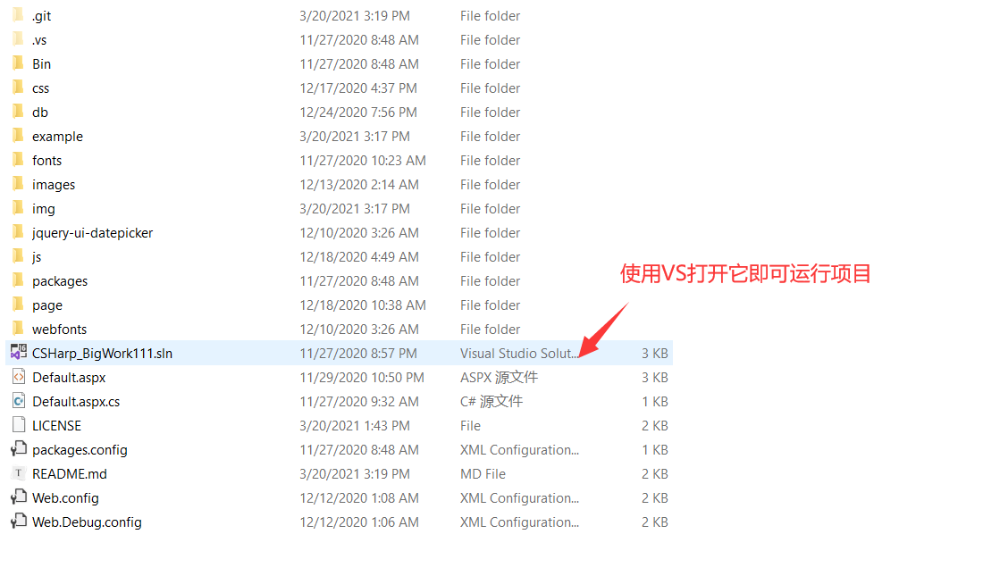

# 简介
**学生报名教务管理系统** 这是一个在学校时，宿舍三人小组基于ASP.NET合作开发的学校报名教务管理系统项目，项目内有我们的答辩文档，代码，数据库设计等资料，可用于交C#的Web开发大作业，可免费使用，由于当时多人开发经验不足，出现文件夹和文件命名多余的情况，但是项目能稳定运行，可以审查缴费，具有3层权限分工管理功能，具备对学生，教师，科长信息的增删改查的功能，具有缴费限定次数的安全锁，缴费信息统计，针对不同类型的科目缴费金额实时修改的功能，可有效管理学生报名缴费的任务。

# 开发环境
软件：Visual Studio 2019 

数据库：Access2010 

技术栈：
- 前端：HTML5 + CSS3 + JS + Bootstrap
- 后端：C# + ASP.NET

# 使用方法
1、下载项目到您的电脑上
2、点击**CSHarp_BigWork111.sln**文件用VS运行它

# 运行截图
## 学生登录界面

## 科长后台界面

## 科长添加信息界面

## 财务后台界面

## 辅导员后台界面

